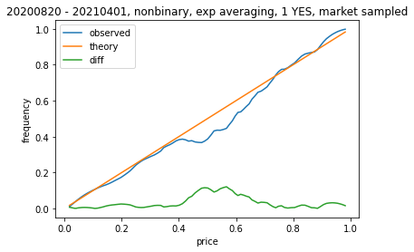
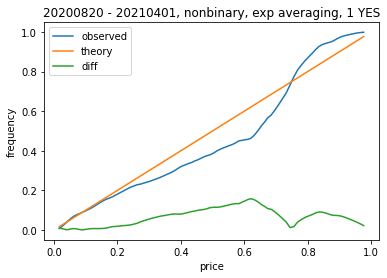
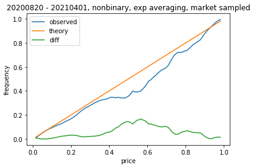
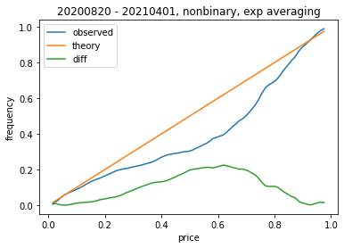
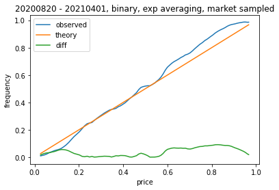
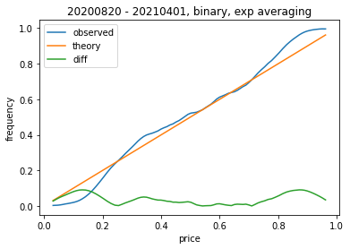
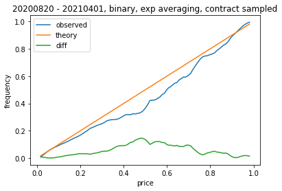
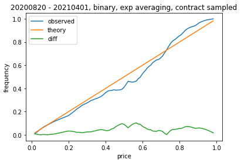
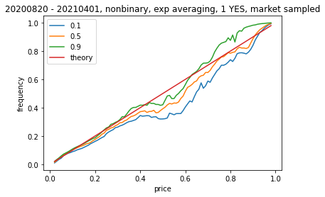

# Investigate whether PredictIt markets are well calibrated

## Academic Research Prior Work

Existing work on whether prediction markets are well calibrated.

[DO PREDICTION MARKETS PRODUCE WELL-CALIBRATED PROBABILITY FORECASTS?. Page, Clemen 2013](page_clemen_ej_2013.pdf)

They use the following approach:

- Local Regression Estimator (sampled at 100 discrete price points, 0.10 sized window)
- Sample on transactions
- Sample 10 per market.
- 597 competitions, 1787 markets, 512612 transactions
- InTrade dataset

## Replication

For adapting to available predictit market data. We can:

- Keep N samples per contract (or market).
- Sample on price changes?
    - Or maybe hourly
- Local Regression Estimator
    - Or just use simple windowed average for initial implementation

## Implementation

- Determine contracts where outcome can be determined from final market price.
    - Get final market price + check if > 0.98
    - Get final day from db, check last day price
- Aggregate samples per contract.
    - python?
- Merge + compute calibration curve

## Initial Results

We try to sample in a method similar by simpler compare to Page, Clemen by using an exponential weighting function on each of
100 discrete price points to compute the emperical resolution frequencies. We look at both sampling on active contracts on each day,
and also take their approach of collecting a fixed number of samples per market. This normalizes for markets with different # of contracts and trading days.

Initial results on nonbinary markets suggests there is a significant midrange segment where long contracts are overpriced.

{height=150}
{height=150}

That being said, a significant portion of the data came from Biden cabinet markets, where many cabinet picks were
not confirmed. These events were highly correlated, and removing them from the picture weakens the correlation.

We start to see the trend of contracts with price >0.8 being underpriced.

{height=150}
{height=150}

Binary markets seem reasonable well calibrated with the exception of tail probabilities. Probably combination of large "risk-free" rate as well as 2020 election markets being
Trump conspiracy biased.

{height=150}
{height=150}

Finally, it seems like the explanation for the difference between market sampled and day sampled has more to do with
the normalization over number of days rather than normalizing over # of contracts. (should say nonbinary)

{height=150}
{height=150}

Confidence intervals (resampling half of markets, assumes markets reasonable independent)

{height=150}

## Theory
