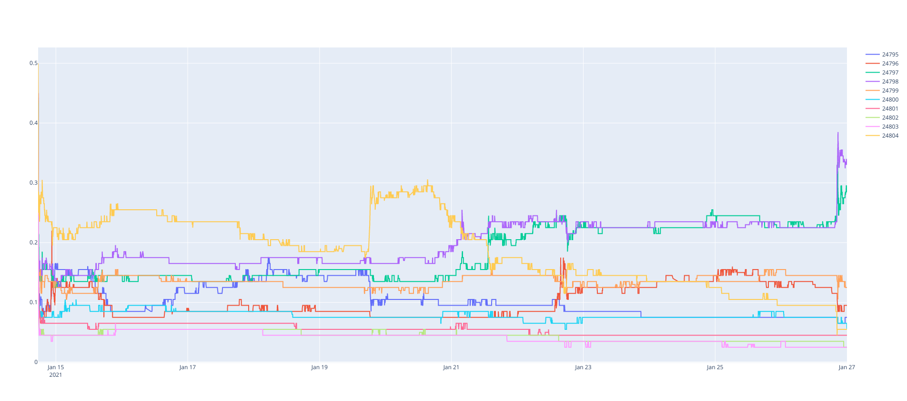
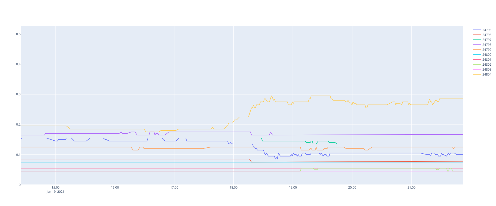
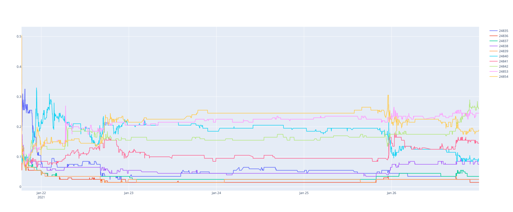
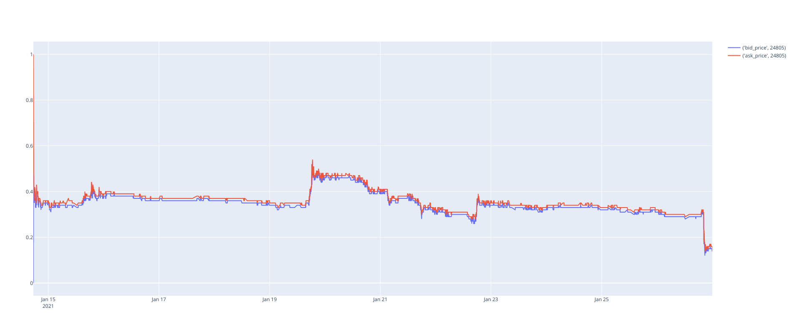

# Momentum Strategy

### Initial Thoughts

Certain contracts appear to have momentum trends that may be exploitable.

For example:

Market 7054: 2021 Impeachment Number of Senators

Market 7054: 2021 Impeachment Number of Senators, Zoomed in on 1/19/2021

Market 7064: Buttigieg Confirmation Votes

Market 7055: McConnell Impeachment Vote

### Rough Strategy Outline

- Focus on momentum trends lasting 10 minutes - 2 hours.
- Taking liquidity only to deal with lack of order book/proper trading api.

### Momentum Hypothesis

- Price Discovery
    - Price discovery on a contract that depends on news probably takes a while to occur due to position limits/limited people paying attention.
    - Espeically on news that is not clear on the outcome (i.e politician says something that can be interpreted to favor some outcome) as opposed to official news announcement of the outcome.

### Strategy Considerations

- Avoid decay patterns. Certain contracts probably have a tendency to decay in price over time (e.x will this happen by Nov 30). In some sense the momentum here is false
- Avoid trading on contracts about to resolve.
    - Traders are paying attention to contracts that are about the resolve so the price discovery
- Predictit 10% fee and 0.01 cent tick size means that trades need fairly positive.
- Price discovery sometimes seems to overshoot before stabilizing. This probably will just incur some cost.

### Strategy Training Ideas

Take ~3 windows for momentum indicators (e.x 5 minute, 15 minutes, 60 minutes)
For $n$ min windows, consider correlation between return [T - n, T] to [T, T + n]?

### Update 06/03/2021
